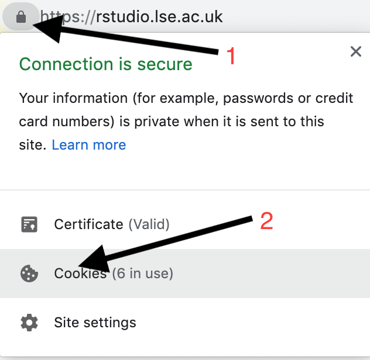
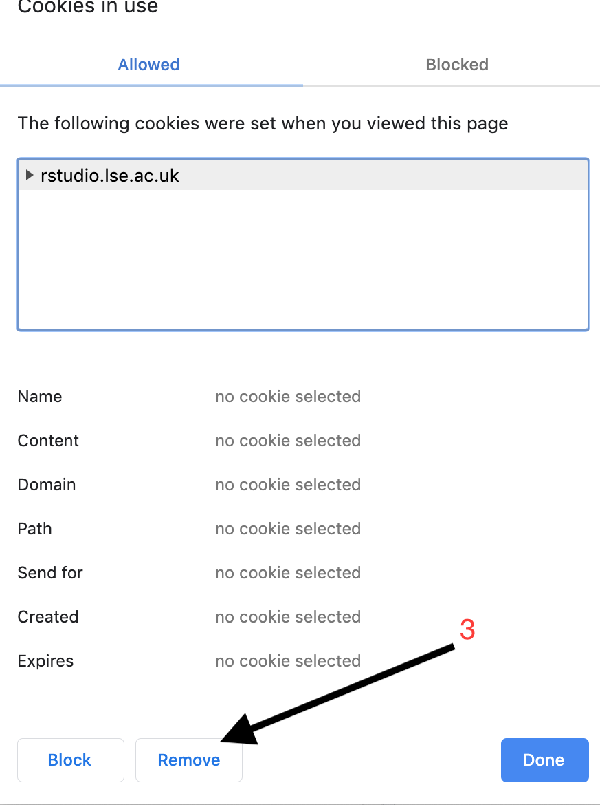

# Instructions for submitting assignments

ME314, LSE Methods Summer Programme 2019

## Setting up R and the Rstudio environment

### The easy way: RStudio server

To avoid configuration problems, we have set up an RStudio server environment that contains all that you need to use for this course, on a cloud server.  You can access to the server at [https://rstudio.lse.ac.uk](https://rstudio.lse.ac.uk) using your LSE username and password.  You only need a web browser and an Internet connection to use this.

**If you are having trouble loading the login page** logging into the service and gets a "too many redirects" error then either using another browser or clearing cookies, in chrome with the following information:

This can be fixed by clearing cookies for rstudio.lse.ac.uk and auth.lse.ac.uk.  For instance in Chrome, by clicking the padlock in the location bar:

### Using R/RStudio locally

For local installation, you can follow one of numerous instructions online, for example [here](https://medium.com/@GalarnykMichael/install-r-and-rstudio-on-windows-5f503f708027).   You should first install [R](https://cran.r-project.org) and then [RStudio](http://www.rstudio.com).

#### Instructions for obtaining assignments

Each lab assignment will be a separate repository from the [lse-me314 site on GitHub](https://github.com/lse-me314).  Each day in lab, you should start with the following steps.

1.  Create a new RStudio project that clones the assignment repo in your RStudio environment.

    Each assignment of this course is created as a github repository. To work on the assigment, first you need to clone the respository (i.e. copy the entire repository). The easiest way to do so is through creating a new project.

    1) Click a project button (near the top-right corner of the screen)
    2) Select "New Project" (this will open a popup window)
    3) Select "Version Control"
    4) Select "Git"
    5) Enter repository URL (for the first assignment, it is https://github.com/lse-me314/assignment01)

2.  Rename the starter files.

    For each day, you will start with a starter file, which is in the RMarkdown format.  You should embed your answers, with code, into your version of the instruction files. The starter file can be found in the project folder newly created in Step 1.

    The first thing you need to do is rename the starter file using your full name. For example, the first assignment file is named `ME314_assignment1_LASTNAME_FIRSTNAME.Rmd`, which you will need to rename by replacing the uppercase terms with your own last and first names, e.g.  `ME314_assignment1_Bloggs_Joe.Rmd`.

    To rename files, you can Rstudio's rename capability: from the "Files" pane, tick the file to rename, then click "Rename".  (Or, if you prefer the command line, you can use R's `file.rename()` function.)

3.  Add your answers to the assignment by editing the renamed file.

4.  "knit" the .Rmd file, which executes the embedded R code and renders it and the embedded comments into html.  From RStudio, you can knit the .Rmd file by clicking the "Knit HTML" button in the top of the editor pane in RStudio.  The resulting HTML file will be saved in your working directory.

5.  (For the mid-term and final exam only) You can upload the resulting HTML file -- renamed! -- to the [course Moodle page](https://shortcourses.lse.ac.uk/course/view.php?id=158).

We will walk you through this process in the Day 1 lab, so don't worry if it seems complicated the first time.  This sort of careful workflow process and file management is part of learning practical data science too!

We do not mark the homework but we will walk through the solutions at the start of computer labs the following day.

#### After finishing an assignment

Don't forget to log out from the server if you are using RStudio Server. You are sharing computing resource with other students. If we observe find a session inactive for long time, we will terminate the session.
